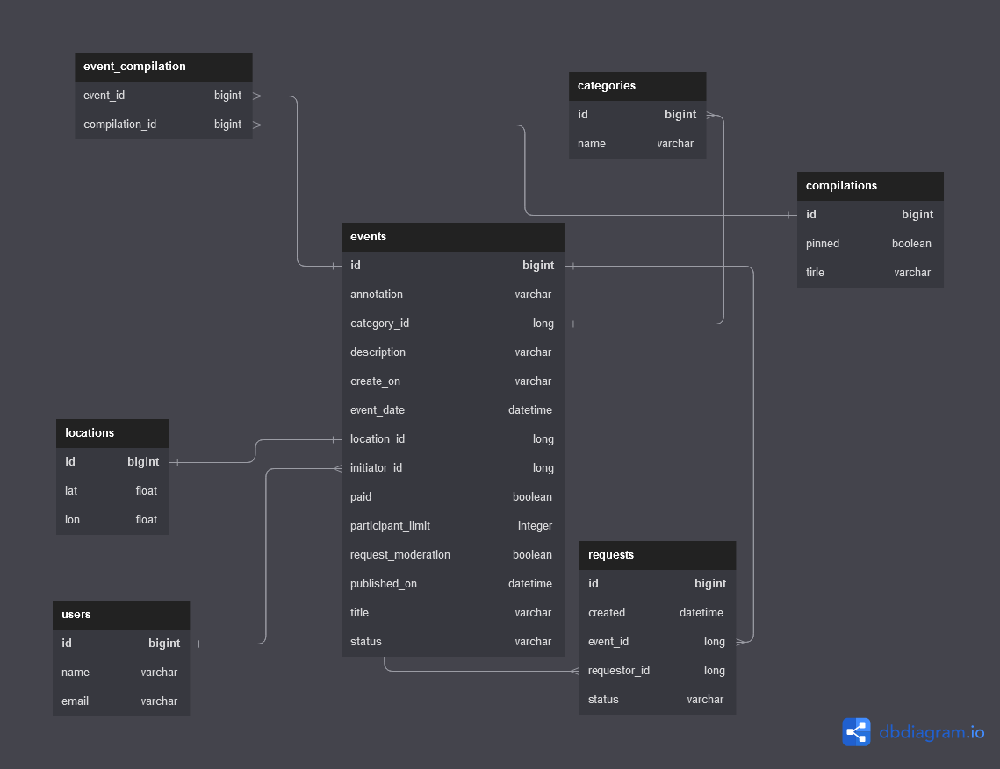
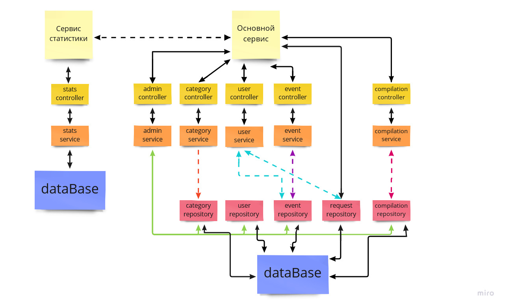

## Это репозиторий проекта "java-explore-with-me"
#### Было сложно, но я справился


Наше приложение **умеет**:
1. Добавлять пользователя/события/категории/подборки событий/заявки на события
2. Администрирование
3. Удаление пользователя/события/категории/подборки событий/заявки на события
4. Изменения пользователя/события/категории/подборки событий/заявки на события
5. Получение пользователя/события/категории/подборки событий/заявки на события

Ссылка на  Pull requests : https://github.com/tortiss0000/java-explore-with-me/pull/2
# Пояснение:
## Схема Базы данных
код для схемы для сайта https://dbdiagram.io
##### [код](code db in dbdiagram.txt)



## Архитектура программы


## Спецификация https://editor-next.swagger.io/
#### [main-service](ewm-main-service-spec.json)
#### [stat-service](ewm-stats-service-spec.json)

### Чтобы проверить программу:
Вы можете воспользоваться программой Docker:

Для этого есть подготовленный [docker-compose.yml](docker-compose.yml)

## И проверить работоспособность с помощью postman коллекции
### Протестировать программу можно с помощью postman
#### [тесты postman для main-service](postman/ewm-main-service.json)
#### [тесты postman для stats-service](postman/ewm-stat-service.json)


Приложение написано на Java. Пример кода:
```java
public class Main {
    public static void main(String[] args) {
        System.out.println("Пришло время практики!");
    }
}

```
------
О том, как научиться создавать такие приложения, можно узнать в [Яндекс-Практикуме](https://practicum.yandex.ru/java-developer/ "Тут учат Java!") 
